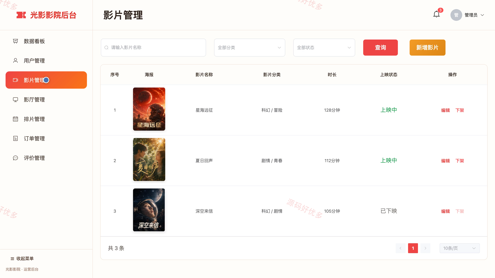

## 源码问题查看主页咨询

### 一、关键词
影院票务、影片排片、在线选座、取票核销

### 二、作品包含
源码+数据库+全套环境和工具资源+本地部署教程

### 三、项目技术
前端技术： Html、Css、Js、Vue3.4、Element-Plus
后端技术：Java、SpringBoot3.2.0、MyBatis-Plus

### 四、运行环境（以下版本亲测，其他版本兼容性请自行测试）
开发工具：IDEA/eclipse + VSCODE

数据库：MySQL5.7+（共9张表）

数据库管理工具：Navicat10以上版本

环境配置软件： JDK17 + Maven3.6.3

前端Nodejs：16+

浏览器：谷歌浏览器

### 五、项目介绍
项目编号：bs005

该项目围绕影院线上选座购票与后台经营管理展开，观众可浏览影片和场次、在线选座购票、查询订单并申请退票；检票员可查询订单和核销取票编号；管理员可维护用户、影片、影厅、排片、订单与评价，并查看经营数据。

角色：用户、检票员、管理员

用户功能：用户注册与登录、影片浏览与分类筛选、影片详情与场次查看、在线选座购票、订单查询与退票申请、个人资料与密码管理、热门影片推荐。

检票员功能：数据看板查看、排片场次查看、观众订单查询、取票编号查询、取票编号核销、个人资料管理。

管理员功能：经营数据看板、用户管理、影片管理、影厅管理、排片管理、订单与核销管理、退票申请查看、评价管理。

### 六、运行截图

